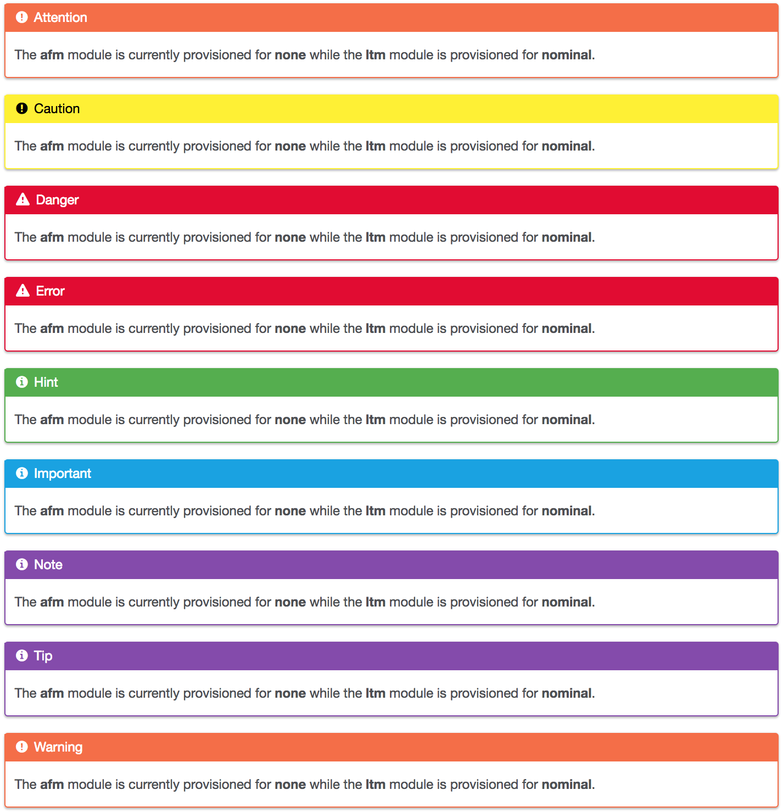

****************************
reStructuredText Admonitions
****************************

Directive Types: "attention", "caution", "danger", "error", "hint", "important", "note", "tip", "warning", "admonition"

Admonitions are specially marked "topics" that can appear anywhere an ordinary body element can. They contain arbitrary body elements. Typically, an admonition is rendered as an offset block in a document, sometimes outlined or shaded, with a title matching the admonition type.  An example can be found below.

